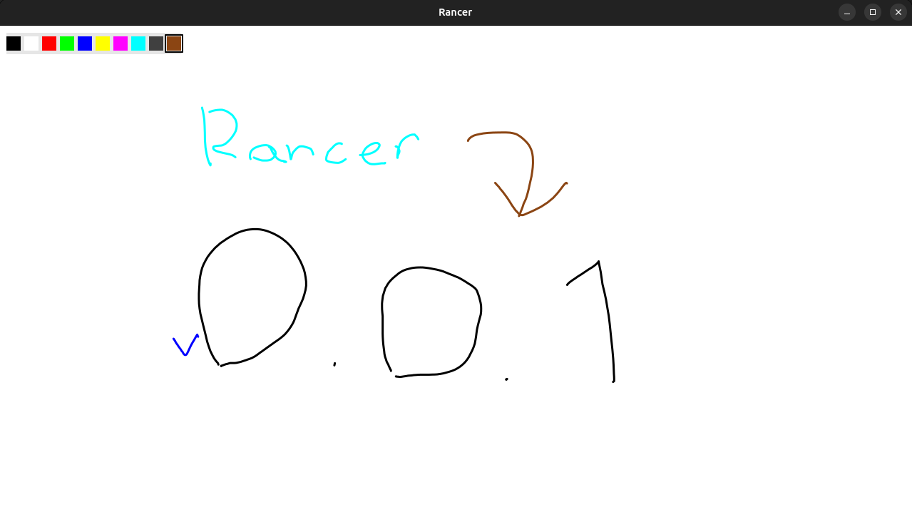

# Rancer



A digital art application built in Rust with cross-platform support.

**Version:** 0.0.3
**License:** [GNU GPL-3.0](LICENSE)

## Features

- Real-time GPU-accelerated drawing with WGPU 28.0
- Stroke management with undo/redo
- 10-color palette with keyboard navigation
- GTK4 window management (Wayland compatible)
- Cross-platform: Linux, Windows, future WASM

## Build & Run

```bash
# Install GTK4 (Ubuntu/Debian)
sudo apt install libgtk-4-dev

# Build and run
cargo build
cargo run
```

## Usage

- **Draw**: Left click and drag
- **Colors**: Up/Down arrows to change
- **Window**: 1280x720 "Rancer" window
- **Brush Size**: Click boxes to change brush size

## Tech Stack

- Rust 1.94+
- GTK4 (window/UI)
- WGPU 28.0 (GPU rendering)
- bytemuck (type casting)

## Status

✅ GTK4 migration complete
✅ WGPU 28.0 integration
✅ Real-time rendering
✅ Mouse input handling

## License

This project is licensed under the GNU General Public License v3.0 - see the [LICENSE](LICENSE) file for details.
